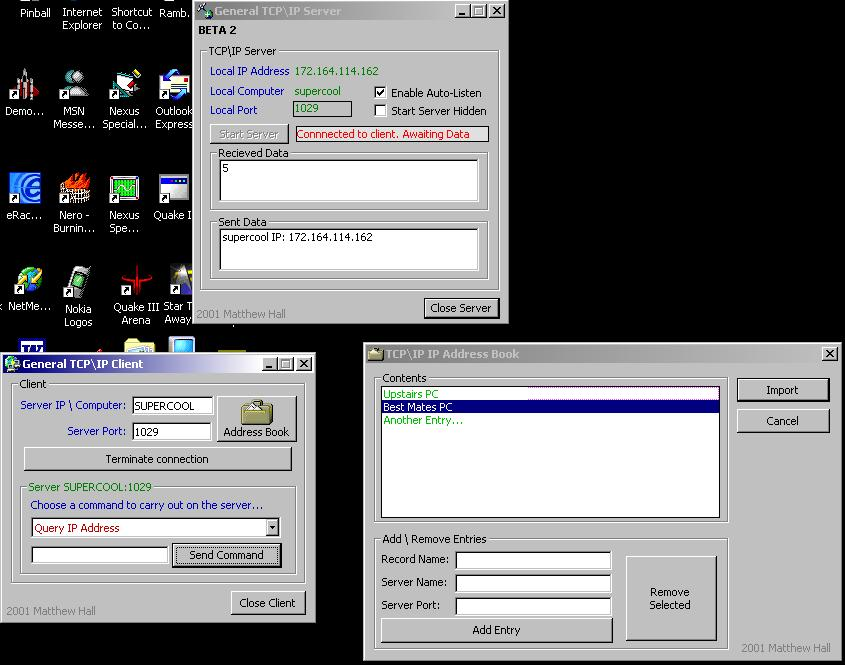



## TCP IP Complete Client Server Application

### Description

Allows application of TCP\IP network communication via two seperate

applications.. You can Query Current Windows Username, Execute EXE file,

Toggle Hide Server, Query IP Address (for DNS resolution), Send Instant

Message, Windows ShellExec and RSA Skipjack Encrypted Chat. It is very easy

to implement more features into the project, just take a quick delve into the

code and all will be clear!

PS. Sorry about the last submission I uploaded the wrong .zip file to the PSC server, and promptly forgot my password =p. Heres the full *and updated version*

PLEASE COMMENT so I can improve\rectify any problems with the code! Cheers guys!
 
### More Info
 

             |
---                |---
**Submitted On**   |2002-04-22 15:12:32
**By**             |[ByteForce UK](https://github.com/Planet-Source-Code/PSCIndex/blob/master/ByAuthor/byteforce-uk.md)
**Level**          |Advanced
**User Rating**    |4.5 (18 globes from 4 users)
**Compatibility**  |VB 5\.0, VB 6\.0
**Category**       |[Complete Applications](https://github.com/Planet-Source-Code/PSCIndex/blob/master/ByCategory/complete-applications__1-27.md)
**World**          |[Visual Basic](https://github.com/Planet-Source-Code/PSCIndex/blob/master/ByWorld/visual-basic.md)
**Archive File**   |[TCP\_IP\_Com745154222002\.zip](https://github.com/Planet-Source-Code/byteforce-uk-tcp-ip-complete-client-server-application__1-34035/archive/master.zip)

